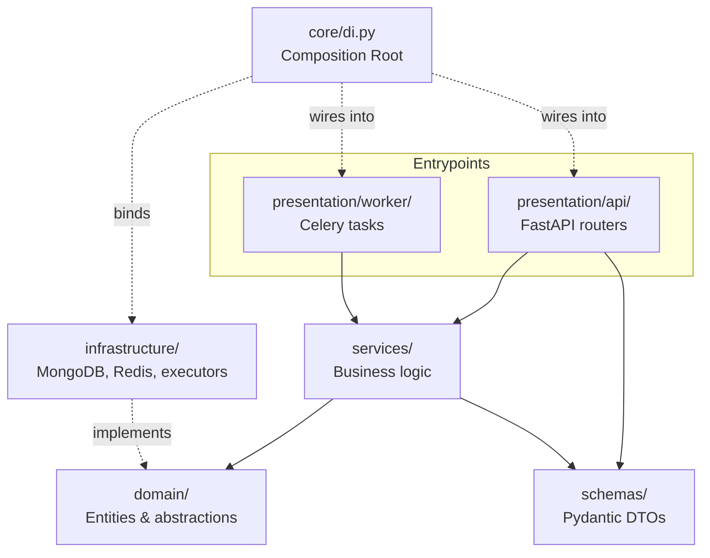

# Architecture

This document describes how Night Crawler is put together: its services, code layout, layers, and background job pipeline. The enforced rules that keep it that way (layering, SOLID, naming, style) live in [CONTRIBUTING.md](CONTRIBUTING.md).

## Services

The application is composed of several services:

| Service | Purpose |
|---------|---------|
| FastAPI | HTTP API |
| Reflex | Web UI: login/register, crawlers and their schedules, a Runs dashboard of every crawler's runs, rate-limit rules, versions (draft, publish; publishing archives the previous one), message templates, selectors, and aids — see [frontend/docs/ARCHITECTURE.md](../frontend/docs/ARCHITECTURE.md) |
| MongoDB | Data persistence (single-node replica set `rs0`, so multi-document transactions work) |
| Redis | Distributed rate limiting |
| RabbitMQ | Message broker |
| Celery | Background workers |
| Celery Beat | Scheduled tasks |

The `web`/`celery_worker`/`celery_beat` containers have live network + credentialed access to MongoDB (`db:27017`) and Redis (`redis:6379`), via the `MONGO_URL`/`MONGO_DATABASE` variables Compose injects (`x-mongo-env`) and `config.py`'s `mongo_url` — no separate DB config is needed to query it from within those containers.

The Reflex frontend talks to the FastAPI backend via server-side `httpx` calls
made from inside its own event handlers - never from the browser - so the
backend needs no CORS configuration.

## Project Structure

```
backend/
└── src/
    └── night_crawler/
        ├── presentation/             # Inbound adapters
        │   ├── api/                  # FastAPI HTTP adapter
        │   │   ├── auth.py
        │   │   ├── crawler.py
        │   │   ├── crawler_execution.py
        │   │   ├── crawler_version.py
        │   │   ├── dependencies.py
        │   │   ├── exception_handler.py
        │   │   ├── message_aid.py
        │   │   ├── message_aid_proxy.py
        │   │   ├── message_aid_rate_limit.py
        │   │   ├── message_selector.py
        │   │   ├── message_template.py
        │   │   ├── root.py
        │   │   └── user.py
        │   └── worker/
        │       └── tasks.py          # Celery task adapter
        ├── core/                     # Cross-cutting & DI wiring
        │   ├── config.py
        │   ├── di.py                 # Composition Root
        │   └── logging.py
        ├── domain/                   # Framework-free core, grouped by kind
        │   ├── exceptions.py         # AppException hierarchy
        │   ├── model/                # constants, entities, shared value objects
        │   ├── ports/                # abstract I/O interfaces (repositories, repository sets, executors…)
        │   ├── rules/                # pure business logic (ordering, validation, proxy ladder…)
        │   └── bundles/              # value objects a use case passes between its steps
        ├── infrastructure/           # Data access & adapters
        │   ├── cache/
        │   │   ├── redis_auth_attempt_limiter.py
        │   │   └── redis_rate_limiter.py
        │   ├── db/                   # Mongo client, index definitions, read/write repository sets, and one repository per entity
        │   ├── external/             # httpx, Playwright, and Patchright request executors
        │   ├── storage/              # dataset CSV export to the local filesystem (`LocalDatasetExportStorage`)
        │   └── tasks/                # Celery job dispatcher
        ├── schemas/                  # DTOs, one per entity
        ├── services/                 # Business logic, one per entity + execution services
        ├── __init__.py
        ├── celery.py
        └── main.py

frontend/                         # detailed in frontend/docs/ARCHITECTURE.md
├── Dockerfile
├── rxconfig.py
├── docs/                         # frontend ARCHITECTURE.md and CONTRIBUTING.md
├── tests/                        # forms.py and api_client.py tests
└── src/
    └── night_crawler/            # same src layout and package name as the backend
        ├── api_client.py         # httpx wrapper for the FastAPI backend
        ├── forms.py              # pure form ⇄ payload helpers
        ├── state/                # rx.State per page (auth, crawlers, crawler detail, version editor, sources, datasets, runs, rate limits)
        ├── components/           # shared layout, nav, form fields
        ├── pages/                # login, register, crawlers, crawler detail, version editor, sources, datasets, runs, rate limits
        └── night_crawler.py      # entrypoint: app = rx.App()
```

## Layers

The codebase follows a layered architecture:

- **presentation/** (Inbound Adapters) — `api/` contains FastAPI routers, dependency stubs, and exception handlers; `worker/` contains Celery task entrypoints. Both call `services/`; neither imports concrete infrastructure.
- **services/** (Business Logic Layer) — Orchestrates Crawlers, Crawler Versions, Message Templates/Selectors/Aids, and their executions. Depends on `domain/` abstractions and `schemas/`; maps between domain entities and DTOs. Never imports concrete infrastructure.
- **schemas/** (DTOs) — Pydantic models used strictly for request payload validation and response serialization across API endpoints.
- **domain/** (Entities & Abstractions) — Framework-agnostic core definitions: pure domain entities (`Crawler`, `CrawlerVersion`, `MessageTemplate`, `MessageSelector`, `CrawlerExecution`, `User`, etc.), abstract repository/rate-limiter/executor interfaces, and the `AppException` hierarchy.
- **infrastructure/** (Data Access & Adapters) — Concrete implementations of the abstract interfaces declared in `domain/`: the MongoDB-backed repositories (PyMongo `AsyncMongoClient`), grouped into `MongoReadRepositories` (no transaction; writes raise) and `MongoWriteRepositories` (one transaction per use case: the Unit of Work pattern), the Redis-backed rate limiter (bound in `core/di.py`), and the httpx/Playwright/Patchright request executors.
- **core/** (Cross-Cutting & DI Wiring) — Settings, logging, and the Composition Root (`core/di.py`), which is the only module allowed to import concrete `infrastructure/` implementations and bind them to the abstract interfaces via FastAPI's `Depends()`/`app.dependency_overrides`. It also creates the process-wide singletons (Mongo client, job dispatcher) and owns their startup and shutdown, and it maps each repository port to its adapter (`REPOSITORY_FACTORIES`), which it hands to `MongoReadRepositories` and `MongoWriteRepositories` to build per request, so no other module names a concrete repository (CONTRIBUTING R1.2.9).

Services reach storage through a repository set (CONTRIBUTING §1.5): `GET` routes inject `get_read_repositories`, which runs without a transaction and rejects writes; `POST`/`PUT`/`PATCH`/`DELETE` routes inject `get_write_repositories`, which runs the whole use case, reads included, in one MongoDB transaction and commits or rolls back. Authentication always reads through read repositories, so a write request uses two sessions.

Dependency direction: `presentation → services → domain ← infrastructure`, with `core/di.py` as the Composition Root where concrete infrastructure is wired for the HTTP and worker entrypoints.



Solid arrows are imports; dotted arrows show how concrete adapters are plugged in behind the `domain/` abstractions without `presentation/` or `services/` ever importing them.

## Background Job Pipeline

Celery workers execute asynchronous jobs while Celery Beat schedules recurring tasks, across 4 execution queues: `discovery` (default), `priority`, `real-time`, and `testing` (`domain/model/constants.py`'s `EXECUTION_QUEUES`), plus `dataset-import`. The Celery app lives in `night_crawler/celery.py`; the dev/prod `celery_worker` service listens on all of them - split queue-specific worker pools out by overriding that command per-environment if `testing` traffic needs to be isolated from production queues. RabbitMQ is the message broker between the API and workers.

A run starts as a `pending` Crawler Execution of the published version, enqueued on the Crawler's `queue` right after it is committed:
- on demand, by `POST /api/crawlers/{crawler_id}/executions`;
- as a test run, by `POST /api/crawler-versions/{version_id}/test-executions` (the Instructions page's **Test run** button): it runs exactly that version, draft, published, or archived, and always goes to the `testing` queue. A Crawler's own `queue` can never be `testing` (`CRAWLER_QUEUES`);
- on schedule: every minute Celery Beat runs `night_crawler.tasks.dispatch_scheduled_crawlers`, which creates and enqueues one run for each Crawler with a published version whose cron `schedule` matches that minute (`croniter`). A schedule always runs; to stop it, clear it. A Crawler with nothing published is skipped until a draft is published.

The worker task `night_crawler.tasks.process_crawler_execution` in `presentation/worker/tasks.py` then:
1. moves the run to `running` (a run that is no longer `pending`, e.g. a redelivered task, is skipped);
2. reads the plan (`services/execution_plan_service.py`): the version's templates with their selectors and aids, the seeded Context, and the templates in dependency order - a template depends on another when one of its `{{placeholders}}` is the `title` of a selector on that other template (`domain/rules/template_ordering.py`; a cycle fails the run);
3. runs the plan with no transaction open (`services/crawler_run_service.py`), each request first waiting on its rate limits (**Rate limits** below): each template is rendered from the Context as it stands, once per combination of its `name[]` lists (fan-out), and runs again while it feeds itself (a placeholder one of its own selectors harvests: a page token repeats each combination until it stops changing, a list of links runs each new element once; DOMAIN_MODEL §5.8), and sent by the engine its Message Aid's `render_mode` selects - `none` → httpx, `playwright` → Playwright, `stealth` → Patchright. Harvested values not bound to one of the Crawler's fields feed the Context for later templates;
4. saves the Context, `request_count` / `error_count`, and `succeeded`/`failed` in one short transaction.

A request that fails for good, after its retries, stops the run: it is counted, no later request is sent, and the run is `failed` with that request's error. A missing placeholder or a crash fails it too. What was harvested before is kept: the Context is saved and the partial CSV stays in `raw/`. Each task opens its own MongoDB client (`core/di.py::open_task_repositories`): Celery runs each task in a fresh event loop, and an async client can't cross loops.

**Session sharing.** Within one run, every request to the same exact host starts from the cookies and shareable headers earlier requests left behind, whatever engine sent them (`domain/rules/host_session.py`), unless the version turns `is_host_session_sharing_enabled` off:
- httpx sends shared cookies in the `Cookie` header, and captures every `Set-Cookie` along the redirect chain;
- the browsers seed their context with the shared cookies, User-Agent, and other headers, and capture the context's cookies plus the headers they actually sent (User-Agent, client hints, `Accept-Language`, custom ones);
- a template's own headers always win; `Host`, `Content-*`, `Cookie`, and hop-by-hop headers are never shared, nor is httpx's generic default User-Agent.

Playwright and Patchright executors are scoped to one crawler execution.
They launch browsers lazily, reuse a page/context for the same exact host,
proxy, and User-Agent while host-session sharing is enabled, then close
those resources when the execution finishes. With sharing disabled, each
request gets an isolated context and page, while its browser can still be
reused until the execution ends.

Browser GET responses with a JSON content type are harvested from the raw
response body using JMESPath, without parsing the browser's HTML snapshot.
HTML responses continue to use the live page for CSS/XPath selectors and
click/select actions.

Values for the Crawler's fields go to the execution's dataset CSV (`crawler_execution_datasets`): one row per match of the innermost iterator or click of each template that has a selector titled after one of those fields (a `context` selector reads a placeholder's value, e.g. the fanned-out `place_id`); when the run ends the rows are validated against the Dataset's fields (required, unique, type, pattern, no empty column; DOMAIN_MODEL §5.4) and parsing is `parsed` only when the run succeeded and the validation passed. Other values replace the execution's Context, which the Crawler's next execution inherits (DOMAIN_MODEL §4.10).

**Rate limits.** Before every try, retries included, a request waits on the rate limits it falls under (`domain/rules/rate_limits.py`): its aid's rule, keyed `domain:<exact host>`, then its proxy's rule, keyed `proxy:<id>`. Each key holds a moving window (`limits`, e.g. `5/second`) and a penalty, both in Redis (`infrastructure/cache/redis_rate_limiter.py`), so every worker and every run share them. A failure with one of the template's retry codes is a block: it adds `penalty_step_seconds` to the key's extra wait, up to `max_penalty_seconds`; every `decay_after_successes` successes in a row take `decay_step_seconds` off. A penalty untouched for a day is forgotten. Waits are logged (`Rate limited: … wait=`); an unreachable Redis fails the run rather than sending unpaced requests.

**Authentication abuse protection.** Login failures increment Redis counters
for the normalized email and source IP. Five failures for one email or 20
from one IP within 15 minutes cause HTTP 429 until that fixed window expires;
a successful login clears that email's failure counter. Registration allows
10 attempts per source IP in 15 minutes. The limiter hashes identifiers in
Redis keys, is shared by web replicas, and fails closed with HTTP 502 if
Redis is unavailable.

Not built yet: the dataset import into `dataset_*`, the Proxy Ladder, and `pagination` selectors. Retries are built: a request failing with a retry code is retried up to the aid's `max_retry_attempts` before it counts as failed (DOMAIN_MODEL §4.6).

A Crawler's target queue is part of its schedule, set via `POST /api/crawlers` or `PATCH /api/crawlers/{crawler_id}` (`queue`). It is not versioned: changing it never forks a draft, and the next run goes to the new queue.

Crawls never write crawled data to the `dataset_*` collections. As before, each execution produces one CSV from its Crawler's harvested `fields` (stored as `csv_content` on `crawler_execution_datasets`, and exported by the worker through `AbstractDatasetExportStorage`, which Compose mounts at `./var/csv` on the host: always first to `raw/<crawler_id>_<execution_id>_<started>.csv`, then moved to `validated/` when the run succeeded and its rows passed validation; a failed export is logged and leaves `file_path` empty, a failed move leaves the CSV in `raw/`). When the execution ends `succeeded` or `failed`, it enqueues `import_execution_dataset` on the `dataset-import` queue. That task loads the CSV into the Crawler's target collection (`dataset_venues`, `dataset_reviews`, or `dataset_menus`): it dedupes by natural key, runs change detection, and records insert/update/unchanged/rejected counts. See [DOMAIN_MODEL.md §5.3](DOMAIN_MODEL.md#53-execution-dataset-csv).
