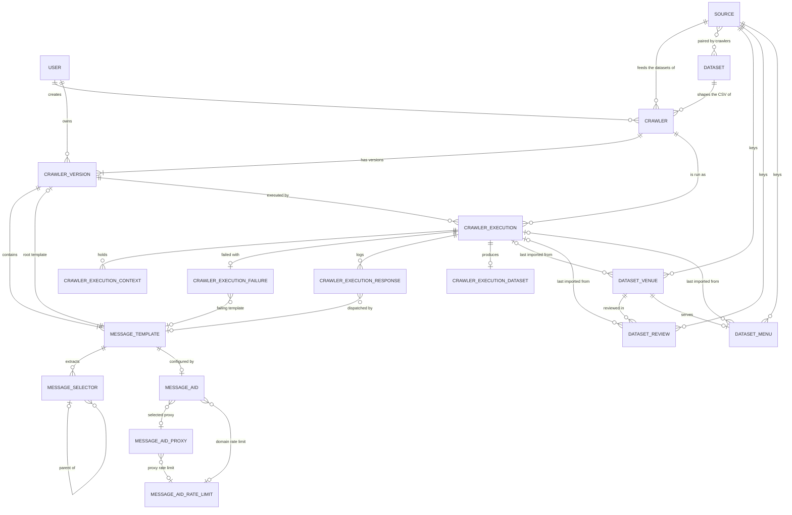

# Domain Model

This document describes Night Crawler's domain: its vocabulary, entities, value objects, relationships, and the structural invariants that always hold. It is extracted from `backend/src/night_crawler/domain/` (entities) and `infrastructure/db/schema.py` (indexes and validators) — when the two disagree with this file, the code wins and this file must be updated.

What the system must deliver — target sources, fields, deduplication, incremental updates, fault tolerance — lives in [BUSINESS_RULES.md](BUSINESS_RULES.md). How the code is layered lives in [ARCHITECTURE.md](ARCHITECTURE.md).

---

## 1. Ubiquitous Language

| Term | Meaning |
|---|---|
| **Crawler** | A named crawl definition pairing one **source** (where the data comes from) with one target **dataset** (what it downloads): its `fields`, the dataset fields it downloads, and an optional cron `schedule` that always runs the published version (an empty schedule means manual runs only). |
| **Dataset** | What we expect to download, stored as a record: its **fields**. `venues`, `reviews`, and `menus` are built in; more can be added. Every Crawler is linked to exactly one; one Dataset can be fed from many Sources. |
| **Dataset field** | One field of a Dataset: its `name`, `type`, `pattern` (the regex its values should match), and whether it is required (every Crawler on the Dataset lists it in its `fields`, and a row without it is dropped) or unique (never repeated within one Source). `item_id` is always required and unique. |
| **Source** | The origin of the data: a website crawled data comes from (e.g. TheFork), stored as a record. Every Crawler is linked to exactly one. A Source feeds zero or more Datasets and a Dataset is fed by zero or more Sources; that pairing is never stored on its own, it is whatever the Crawlers pair. |
| **Crawler Version** | A snapshot of a Crawler's request tree, identified by its UUID and ordered by `created_at`. Exactly one lifecycle status: `draft`, `published`, or `archived`. A published version is archived only when a draft is published over it; it can't be archived on its own. |
| **Message Template** | One outbound request node (`action`, `url`, `body`, `headers`) in a Crawler Version. Every version has exactly one **root template**. |
| **Message Selector** | An extraction rule on a template: `value`, `boolean`, `iterator`, `click`, `select`, or `pagination`. Selectors nest via `parent_selector_id`; a selector's `title` names what it harvests. |
| **Message Aid** | Optional per-template execution settings: proxy, render mode, TTL, ban/retry codes, retry budgets, rate limit. |
| **Proxy** (`MessageAidProxy`) | An admin-managed, pooled proxy credential. |
| **Rate Limit** (`MessageAidRateLimit`) | A reusable sliding-window + penalty/decay rule, applied per domain or per proxy. |
| **Crawler Execution** | One run of a Crawler Version. Tracks an execution `status`, a separate `parsing_status`, and run `metrics`. |
| **Crawler Execution Context** | Key/value state harvested (or externally supplied) during one Crawler Execution. Iterator keys end in `[]`. It is also the run's **checkpoint**: an interrupted execution resumes from it. |
| **Placeholder** | `{{name}}` inside a template's action/url/body/headers, resolved from the Crawler Execution Context. |
| **Fan-out** | Running one template once per combination of array (`key[]`) placeholder values. |
| **Self-fed placeholder** | A template placeholder that one of the template's own selectors harvests. The template runs again while it changes: per combination for a single value (e.g. a page token), and for each new element of a list (e.g. links) — §5.8. |
| **Execution dataset** | The CSV one Crawler Execution produces from harvests whose selector title matches one of the Crawler's fields. The crawl's only output. |
| **Dataset import** | The separate process that loads a finished execution dataset into the Crawler's target Dataset collection. The only writer of `dataset_*`. |
| **Dataset** | The final, deduplicated store of crawled data: `dataset_venues`, `dataset_reviews`, `dataset_menus`. It outlives the Crawlers and Executions that fed it. |
| **Dataset record** | One Venue, Review, or Menu document. Identified by its **natural key**: its Source + its `item_id` (the website's own ID for the item; a menu's is its venue's), so the same ID on two websites never merges. |
| **Upsert** | How the import writes a dataset record by natural key: insert if unknown, otherwise update in place. Never a second copy. |
| **Content hash** | A hash of a record's normalized, non-volatile fields. Equal hash = unchanged record. |
| **Sighting** | An imported row for a record that already exists. Always bumps `last_seen_at`; bumps `updated_at` only when the content hash changes. |
| **Render mode** | Which engine dispatches a template: `none` (httpx), `playwright`, or `stealth` (Patchright). |
| **Proxy Ladder** | The opt-in escalation strategy for blocked dispatches (direct → cookie harvest → IP rotation). |

---

## 2. Aggregates

The model splits into five groups. Each aggregate root owns the lifecycle of the entities beneath it — deleting the root deletes them.

| Aggregate | Root | Owns | Purpose |
|---|---|---|---|
| **Identity** | `User` | — | Who can act, and with which role. |
| **Crawler definition** | `Crawler` | `CrawlerVersion` → `MessageTemplate` → `MessageSelector` (tree), `MessageAid` (0..1) | *What* to crawl and how. |
| **Shared resources** | `Source`, `Dataset`, `MessageAidProxy`, `MessageAidRateLimit` | — | Pools referenced by crawlers and never owned by one; any user creates them, only admins edit or delete them. |
| **Execution** | `CrawlerExecution` | `CrawlerExecutionContext`, `CrawlerExecutionFailure`, `CrawlerExecutionResponse`, `CrawlerExecutionDataset` | One run of a Crawler Version: its checkpoint, metrics, debug trail, and the CSV it produced. |
| **Dataset records** | `DatasetVenue` | `DatasetReview` (many), `DatasetMenu` (0..1) | The final crawled data, filled only by the dataset import. Not owned by any Crawler or Execution. |

### 2.1 How `domain/` is organized

Code in `domain/` is grouped by *kind*, not by aggregate:

| Folder | Holds | Ask: is it… |
|---|---|---|
| `model/` | `entities.py`, `value_objects.py` (shared ones), `constants.py` | …a business object with an `id` (entity), an immutable value used across the domain (value object), or fixed vocabulary (constant)? |
| `ports/` | `Abstract…` interfaces, plus the result types they return | …something that does I/O? The domain only declares it; `infrastructure/` implements it. |
| `rules/` | Pure functions, plus value objects only that rule uses (e.g. `ProxyLadderState`) | …a decision computed from data, with no I/O, clock, or framework? |
| `bundles/` | Frozen dataclasses a use case passes between its steps | …a parameter or result bundle for `services/` rather than a business concept? |
| `exceptions.py` | The `AppException` hierarchy | …an error a rule or port raises? |

Everything in `domain/` imports only the standard library and other `domain/` modules, and nothing in it is mutated in place.

---

## 3. Entity Relationships



### 3.1 Relationship rules

MongoDB has no foreign keys. A reference is a string field holding the target's `_id`. The delete behaviour below (`CASCADE`, `SET NULL`, `RESTRICT`) is carried out by the repositories inside one write-repositories transaction, so it stays all-or-nothing.

| From → To | Cardinality | On delete of the target (write-transaction behaviour) |
|---|---|---|
| Crawler → User (`user_id`, creator) | many → 1 | `CASCADE` — the user's Crawlers are deleted |
| Crawler → Dataset (`dataset_id`) | many → **1** (required) | **`RESTRICT`** — a Dataset a Crawler uses can't be deleted, and an edit that would break a linked Crawler's fields is refused |
| Crawler → Source (`source_id`) | many → **1** (required) | **`RESTRICT`** — a Source a Crawler uses can't be deleted; relink the Crawler first |
| Source ↔ Dataset | many ↔ many, **derived** | No reference of its own: a Source feeds the Datasets its Crawlers target, and a Dataset is fed by its Crawlers' Sources |
| Dataset Venue / Review / Menu → Source (`source`) | many → 1 | **`RESTRICT`** — part of the natural key |
| Crawler Version → Crawler | many → 1 | `CASCADE` |
| Crawler Version → User (`user_id`, owner) | many → 1 | `CASCADE` |
| Crawler Version → root Message Template (`message_template_root_id`) | 1 → 1 | **Not maintained** (see DM-12) |
| Message Template → Crawler Version | many → 1 | `CASCADE` |
| Message Selector → Message Template | many → 1 | `CASCADE` |
| Message Selector → parent Message Selector | many → 0..1 | `CASCADE` — deleting a selector deletes its subtree |
| Message Aid → Message Template | **1 → 1** (unique) | `CASCADE` |
| Message Aid → Proxy (`selected_proxy_id`) | many → 0..1 | `SET NULL` |
| Message Aid → Rate Limit (`rate_limit_id`) | many → 0..1 | `SET NULL` |
| Proxy → Rate Limit (`rate_limit_id`) | many → 0..1 | `SET NULL` |
| Crawler Execution → Crawler | many → 1 | `CASCADE` |
| Crawler Execution → Crawler Version | many → 1 | **`RESTRICT`** — a version that has been run cannot be deleted |
| Crawler Execution Context → Crawler Execution | many → 1, unique per (`crawler_execution_id`, `key`) | `CASCADE` |
| Crawler Execution Failure → Crawler Execution | **1 → 1** (unique) | `CASCADE` |
| Crawler Execution Response → Crawler Execution | many → 1 | `CASCADE` |
| Crawler Execution Dataset → Crawler Execution | **1 → 1** (unique) | `CASCADE` — the exported file on disk is kept |
| Crawler Execution Failure / Response → Message Template | many → 0..1 | `SET NULL` — history survives template deletion |
| Dataset Venue / Review / Menu → Crawler (`crawler_id`) | many → 0..1 | `SET NULL` — crawled data survives its Crawler |
| Dataset Venue / Review / Menu → Crawler Execution (`last_execution_id`) | many → 0..1 | `SET NULL` — crawled data survives its Execution |
| Dataset Review → Dataset Venue (`venue_id`) | many → 1 | `CASCADE` |
| Dataset Menu → Dataset Venue (`venue_id`) | **1 → 1** (unique) | `CASCADE` |

### 3.2 Collections

Each entity is stored in its own collection. The surrogate `id` is stored as the document's `_id`.

| Entity | Collection |
|---|---|
| User | `users` |
| Crawler | `crawlers` |
| Crawler Version | `crawler_versions` |
| Message Template | `message_templates` |
| Message Selector | `message_selectors` |
| Message Aid | `message_aids` |
| Message Aid Proxy | `message_aid_proxies` |
| Message Aid Rate Limit | `message_aid_rate_limits` |
| Crawler Execution | `crawler_executions` |
| Crawler Execution Context | `crawler_execution_contexts` |
| Crawler Execution Failure | `crawler_execution_failures` |
| Crawler Execution Response | `crawler_execution_responses` |
| Crawler Execution Dataset | `crawler_execution_datasets` |
| Dataset Venue | `dataset_venues` |
| Dataset Review | `dataset_reviews` |
| Dataset Menu | `dataset_menus` |

---

## 4. Entities

All entities use a surrogate `id` (UUIDv4 string) and carry `created_at`/`updated_at` (naive UTC) unless noted. Only non-obvious attributes are listed.

### 4.1 User

| Attribute | Type | Default | Constraints / notes |
|---|---|---|---|
| `email` | str | — | Unique (natural key). |
| `hashed_password` | str | — | Never leaves the domain/auth boundary. |
| `role` | enum | `user` | `admin` · `user` · `viewer`. |

Has no `updated_at`.

### 4.2 Crawler

| Attribute | Type | Default | Constraints / notes |
|---|---|---|---|
| `user_id` | Ref User | — | Creator. |
| `title` | str(255) | — | |
| `source_id` | Ref Source | — | Required; must exist. Every dataset record imported from it is keyed on this Source. Not versioned. |
| `dataset_id` | Ref Dataset | — | Required; must exist. What it downloads; its `fields` are checked against it. |
| `fields` | list[str] | — | At least one. Which Dataset fields each execution downloads, in CSV order ([§5.4](#54-crawler-fields)). Not versioned. |
| `schedule` | str \| null | `null` | 5-field cron expression. |
| `queue` | enum | `discovery` | One of `CRAWLER_QUEUES` (every execution queue but `testing`): where every run of the Crawler, scheduled or manual, is sent. Part of its schedule, not versioned. |

### 4.3 Crawler Version

| Attribute | Type | Default | Constraints / notes |
|---|---|---|---|
| `crawler_id` | Ref Crawler | — | |
| `user_id` | Ref User | — | Owner: whoever created the draft. |
| `status` | enum | `draft` | `draft` · `published` · `archived`. `published` → `archived` only by publishing another draft. |
| `message_template_root_id` | str \| null | — | Points at a template of this same version. |
| `published_at` | datetime \| null | `null` | Set on publish. |
| `is_proxy_ladder_enabled` | bool | `false` | |
| `is_host_session_sharing_enabled` | bool | `true` | |

### 4.4 Message Template

| Attribute | Type | Default | Constraints / notes |
|---|---|---|---|
| `crawler_version_id` | Ref Crawler Version | — | |
| `action` | enum | — | `GET` · `POST` · `PUT` · `PATCH` · `DELETE` · `CLICK`. |
| `url` | str(2048) | — | May contain placeholders. |
| `body` | text \| null | `null` | May contain placeholders. |
| `headers` | JSON | `{}` | String values may contain placeholders. |

### 4.5 Message Selector

| Attribute | Type | Default | Constraints / notes |
|---|---|---|---|
| `message_template_id` | Ref Message Template | — | |
| `parent_selector_id` | Ref Message Selector \| null | `null` | `null` = top-level. |
| `type` | enum | — | `value` · `iterator` · `boolean` · `click` · `select` · `pagination`. |
| `path` | text | — | Read according to `source` (below). |
| `target` | str | `__text` | For HTML matches: `__text` reads the element's text, anything else reads that attribute. For `select`: the option value to pick. |
| `title` | str \| null | `null` | Harvest name: a Context key, a CSV field (matches one of the Crawler's `fields`, §5.4), or a placeholder source. Never ends in `[]` (refused, 422): under an `iterator`, `click`, or `select` the Context key becomes `title[]` on its own, and templates still use `{{title}}`. |
| `config` | JSON \| null | `null` | A `pagination` selector's settings (§5.7); required for that type, forbidden for the others. |
| `source` | enum | `content` | What `path` reads: `content` · `headers` · `url` · `context`. |

How `path` reads, by `source` and response:

| `source` | Response | `path` is | Value |
|---|---|---|---|
| `content` | HTML | XPath when it starts with `/`, `./`, `../`, or `(`; otherwise a CSS selector | The first match, read by `target` |
| `content` | JSON (`Content-Type` contains `json`) | JMESPath | The result as is (lists and objects included) |
| `headers` | any | A regex, matched against each response header written as `name: value` with the name lower-cased (cookies are `set-cookie:` lines) | The first capture group `(...)`, or the whole match without one |
| `url` | any | A regex over the final URL (after redirects) | Same |
| `context` | any | A placeholder name | That placeholder's value in the template's run (e.g. the `place_id` a detail page was fanned out over); `boolean` tells whether it has one |

A `headers`/`url` path must compile as a regex (checked on write). Only `value` and `boolean` selectors can read `context` (`CONTEXT_SELECTOR_TYPES`, checked on write); the placeholder must be one the template's request uses.

Selector roles:
- `value` / `boolean` **harvest**: the first match, or whether anything matched.
- `iterator` **repeats** its children once per match, each scoped to that match (an HTML node, a JSON item, or a regex match string for `headers`/`url`). Each match is one row; children's titles become `title[]` lists.
- `click` / `select` **act** on each match of a live page in turn, then run their children against the **whole page** as it is after that action (not only inside the match). Each action is one row, like an iterator. httpx has no live page: it runs the children once against the page as fetched, and their titles are still `title[]` lists (of one element).
- `pagination` **discovers** how many pages to fetch (§5.7).

### 4.6 Message Aid

| Attribute | Type | Default | Constraints / notes |
|---|---|---|---|
| `message_template_id` | Ref Message Template | — | Unique — at most one aid per template. |
| `selected_proxy_id` | Ref Proxy \| null | `null` | `null` = no proxy. |
| `render_mode` | enum | `none` | `none` · `playwright` · `stealth`. |
| `ttl` | int \| null | `null` | Seconds, > 0. |
| `retry_codes` | list[str] \| null | `null` | Failure codes retried: status codes as strings, or `"timeout"`. `null` = `DEFAULT_RETRY_CODES`. |
| `success_codes` | list[str] \| null | `null` | Status codes that count as a successful response, as strings. When set, exactly these succeed (e.g. `404` for a page meant to be missing, which is then harvested); any other status fails. `null` = any status below 400 (`domain/rules/response_status.py`). |
| `max_retry_attempts` | int \| null | `null` | ≥ 0. Retries after a request's first try; `0` never retries. `null` = `DEFAULT_MAX_RETRY_ATTEMPTS`. |
| `rate_limit_id` | Ref Rate Limit \| null | `null` | Domain-scoped rate limit. |

**Retries.** A request that fails with one of the retry codes (the HTTP status, or `timeout`) is sent again, up to `max_retry_attempts` times, waiting 1 s, 2 s, 4 s, … (at most 30 s) between tries (`domain/rules/request_retries.py`). It counts as failed only once its retries are used up; a later success counts as a success. Any other failure (a code not listed, a dropped connection) fails at once. A request that fails for good stops the whole execution, which ends `failed`.

### 4.7 Message Aid Proxy

| Attribute | Type | Default | Constraints / notes |
|---|---|---|---|
| `url` | str(2048) | — | |
| `user` | str \| null | `null` | |
| `password` | str | — | Write-only: never returned by the API. |
| `headers` | JSON | `{}` | |
| `rate_limit_id` | Ref Rate Limit \| null | `null` | Proxy-scoped rate limit. |

### 4.8 Message Aid Rate Limit

| Attribute | Type | Default | Constraints / notes |
|---|---|---|---|
| `name` | str \| null | `null` | |
| `rate_limit_string` | str | — | `limits` window syntax, e.g. `50/minute`. |
| `penalty_step_seconds` | int | — | ≥ 0. |
| `max_penalty_seconds` | int | `0` | ≥ 0. |
| `decay_after_successes` | int | — | > 0. |
| `decay_step_seconds` | int | `0` | ≥ 0. |

Holds configuration only; the live window and penalty state lives in Redis.

**Applying it.** A Message Aid's rule limits the exact host of each request its template sends (key `domain:<host>`); a proxy's rule limits every request through that proxy (key `proxy:<id>`). Every try waits for a slot in the key's moving window, after any penalty. A failure with one of the template's retry codes is a block: the penalty grows by `penalty_step_seconds`, up to `max_penalty_seconds` (`0` turns penalties off). Every `decay_after_successes` successes in a row take `decay_step_seconds` off it, never below zero (`domain/rules/rate_limits.py`). Keys are shared by every run and worker; a penalty untouched for a day resets.

### 4.9 Crawler Execution

| Attribute | Type | Default | Constraints / notes |
|---|---|---|---|
| `crawler_id` | Ref Crawler | — | |
| `crawler_version_id` | Ref Crawler Version | — | `RESTRICT`. |
| `status` | enum | `pending` | `pending` · `running` · `succeeded` · `failed` · `cancelled`. |
| `parsing_status` | enum | `pending` | `pending` · `parsing` · `parsed` · `failed`. |
| `queue` | enum | `discovery` | The queue actually dispatched to: the Crawler's when the run is created, or `testing` for a test run of any version. |
| `started_at` / `finished_at` | datetime \| null | `null` | Duration = `finished_at − started_at`. |
| `resume_count` | int | `0` | ≥ 0. Times this execution was resumed from its checkpoint after an interruption. |
| `metrics` | embedded | all `0` | Run metrics, below. |

`metrics` fields, all int ≥ 0:

| Field | Meaning |
|---|---|
| `request_count` | Requests sent, each counted once however many times it was retried. |
| `error_count` | Requests that still failed after their retries. Error rate = `error_count / request_count`. |
| `retry_count` | Retries sent on top of `request_count`. |
| `records_skipped` | Venues not fetched in detail because listing signals showed no change (§5.5). Written as `sighting` rows. |

Insert/update/unchanged counts belong to the import, so they live on the Crawler Execution Dataset (§4.12).

### 4.10 Crawler Execution Context

| Attribute | Type | Default | Constraints / notes |
|---|---|---|---|
| `crawler_execution_id` | Ref Crawler Execution | — | |
| `key` | str | — | `name` = one value; `name[]` = a list. |
| `value` | primitive | — | String, number, boolean, or `null`. Objects and lists harvested into a scalar key are stored as JSON text. |
| `position` | int \| null | `null` | `null` for a `name` key; the element's index for a `name[]` key. Unique per (execution, key, position): one entry per `name`, one per element of a `name[]`. |
| `active_value` | JSON \| null | `null` | Iterator element in flight during the last dispatch. The resume point after an interruption. |

Where values come from, in order:
1. **Inherited:** a new execution starts with the Context of the Crawler's latest execution. Test runs (queue `testing`) are skipped: they inherit like any run, but no later run inherits from them.
2. **Seeded:** `POST .../executions` with `{"context": {...}}` replaces inherited keys, e.g. a `parish[]` list to fan out over, or an API key a header uses.
3. **Harvested:** a selector whose `title` is not one of the Crawler's fields writes its key. The first harvest of a key in a run replaces the inherited value; later harvests in the same run extend `[]` lists; a miss never erases a value.

The Crawler's current Context (its latest execution's) is read and edited with `GET /api/crawlers/{id}/context` and `PUT`/`DELETE .../context/{key}`; the next execution inherits the edits. Seeded and edited keys can't start with `_`, take primitives, and `[]` keys take lists of primitives. Execution responses list only `context_keys`; the context endpoint returns values.

### 4.11 Execution records (one per Crawler Execution unless noted)

| Entity | Key attributes | Notes |
|---|---|---|
| **Crawler Execution Failure** | `message_template_id?`, `error_message`, `response_status_code/text/headers?`, `validation_errors[]` | Debug snapshot; overwritten on each new failure. |
| **Crawler Execution Response** *(many)* | `message_template_id?`, `url`, `status_code?`, `status_text?`, `headers?`, `body_snippet?` | One per physical dispatch. No `updated_at` — append-only. |

### 4.12 Crawler Execution Dataset

The CSV one Crawler Execution produced (at most one per execution), plus the state of its import. Format in [§5.3](#53-execution-dataset-csv).

| Attribute | Type | Default | Constraints / notes |
|---|---|---|---|
| `crawler_execution_id` | Ref Crawler Execution | — | Unique — at most one dataset per execution. |
| `fields` | list[str] | — | The CSV columns, in order: the Crawler's `fields` at run time. |
| `csv_content` | text | — | The full CSV. Capped by MongoDB's 16 MB document limit. |
| `file_path` | str \| null | `null` | Exported copy, written through `AbstractDatasetExportStorage` when the run finishes: first to `<dataset_export_dir>/raw/<crawler_id>_<crawler_execution_id>_<started>.csv (`<started>`: when the run started, UTC, e.g. `20261001T114123Z`)`, then moved to `<dataset_export_dir>/validated/…` (same name) when the run is `parsed`. `null` when the export failed (the run still finishes, and `csv_content` keeps the CSV); a failed move leaves it in `raw/`. |
| `row_count` | int | `0` | ≥ 0. Rows, header excluded. |
| `import_status` | enum | `pending` | `pending` · `importing` · `imported` · `failed`. |
| `imported_at` | datetime \| null | `null` | Set when `import_status` becomes `imported`. |
| `import_error` | text \| null | `null` | Why the last import attempt failed. |
| `import_metrics` | embedded | all `0` | Import counters, below. All int ≥ 0. |
| `validation` | embedded \| null | `null` | What validating the rows found (`DatasetValidation`, §5.4): `rows_checked`, `rows_dropped_missing_required`, `rows_dropped_duplicate`, `type_mismatches` and `pattern_mismatches` (per field), `empty_columns`, `is_valid`. Returned on every Crawler Execution as `validation`. |

`import_metrics` fields:

| Field | Meaning |
|---|---|
| `records_inserted` | Rows whose natural key was new. |
| `records_updated` | Rows for known records whose content hash changed. |
| `records_unchanged` | Rows for known records with the same content hash, and `sighting` rows (only `last_seen_at` moved). |
| `rows_rejected` | Rows that could not be imported: missing natural key, unknown `venue_item_id`, bad type, or older than the stored record (DM-18). |

### 4.13 Dataset records

The final place where crawled data lives. Written **only by the dataset import**, never by a crawl. Records are **upserted** by natural key, never duplicated, and never deleted by deleting a Crawler or Execution. Every field the source doesn't provide is stored as `null` (or `[]`/`{}` for collections) — a missing field never fails the run.

Every dataset record carries these tracking fields:

| Attribute | Type | Default | Constraints / notes |
|---|---|---|---|
| `source` | Ref Source | — | The writing Crawler's Source; half of the natural key. |
| `crawler_id` | Ref Crawler \| null | — | Crawler of the last imported file. `SET NULL`. |
| `last_execution_id` | Ref Crawler Execution \| null | — | Execution of the last imported file. `SET NULL`. |
| `content_hash` | str | — | Hash of the normalized content fields (§5.5). |
| `created_at` | datetime | — | When the import first inserted it. |
| `last_seen_at` | datetime | — | `started_at` of the newest execution whose file contained it, changed or not. |
| `updated_at` | datetime | — | **Last time its content changed.** Moves only when `content_hash` changes. |

#### Dataset Venue (`dataset_venues`)

| Attribute | Type | Default | Constraints / notes |
|---|---|---|---|
| `item_id` | str | — | The website's own ID for the venue (Google place ID, TheFork/OpenTable restaurant ID). Unique with `source`. |
| `source_url` | str(2048) | — | Canonical detail page. |
| `name` | str | — | Required. |
| `address` | str \| null | `null` | |
| `location` | `{latitude, longitude}` \| null | `null` | Used to plan and re-plan discovery grids. |
| `categories` | list[str] | `[]` | Venue categories/tags. |
| `phone`, `website`, `reservation_url`, `menu_url` | str \| null | `null` | |
| `rating` | float \| null | `null` | 0–5. |
| `review_count` | int \| null | `null` | ≥ 0. |
| `price_range` | str \| null | `null` | As shown by the source, e.g. `€€` or `10–20 €`. |
| `opening_hours` | JSON \| null | `null` | Weekday → list of `{open, close}` ranges. |
| `popular_times` | JSON \| null | `null` | Weekday → hour → busyness %. |
| `live_occupancy` | int \| null | `null` | Busyness % at crawl time. **Volatile** — excluded from `content_hash`. |
| `attributes` | JSON | `{}` | Group → list[str]. Groups: `accessibility`, `amenities`, `service_options`, `highlights`, `payment_options`, `dining_options`, plus any extra group the source shows. |
| `about` | JSON \| null | `null` | Free-form "About" details. |
| `last_crawled_at` | datetime \| null | `null` | Last full detail-page crawl (not just a listing sighting). Drives re-crawl scheduling. |

#### Dataset Review (`dataset_reviews`)

| Attribute | Type | Default | Constraints / notes |
|---|---|---|---|
| `venue_id` | Ref Dataset Venue | — | The reviewed venue. `CASCADE`. |
| `item_id` | str | — | The website's review ID. Unique with `source`. Required: for a website without review IDs, the crawl must harvest another stable value (e.g. the review's permalink). |
| `reviewer_name` | str \| null | `null` | |
| `rating` | int \| null | `null` | 1–5. |
| `published_at` | datetime \| null | `null` | Exact date, or one computed from relative text. |
| `published_at_text` | str \| null | `null` | Raw text, e.g. `hace 2 meses`. |
| `is_published_at_approximate` | bool | `false` | `true` when `published_at` was computed from relative text. |
| `text` | text \| null | `null` | |

#### Dataset Menu (`dataset_menus`)

| Attribute | Type | Default | Constraints / notes |
|---|---|---|---|
| `item_id` | str | — | Always its venue's `item_id`: the menus Crawler harvests the venue's ID as both `item_id` and `venue_item_id`. Unique with `source` — at most one menu per venue. |
| `venue_id` | Ref Dataset Venue | — | Unique. `CASCADE`. |
| `source_url` | str(2048) \| null | `null` | Where the menu was read (may be an external site). |
| `sections` | list[embedded] | `[]` | Each: `name`, `description?`, `items[]`. |

Each menu item: `name`, `description?`, `price?` (float), `currency?`, `price_text?` (raw).

---

### 4.14 Source

| Attribute | Type | Default | Constraints / notes |
|---|---|---|---|
| `name` | str(255) | — | Unique, e.g. `TheFork`. |
| `url` | str(2048) \| null | `null` | The website, for reference. |

A Source has no Dataset list: the Datasets it feeds are those of the Crawlers linked to it (§3.1).

Managed through `/api/sources`: any user creates and lists them; only admins rename or delete them, and a Source still linked to a Crawler can't be deleted.

### 4.15 Dataset

| Attribute | Type | Default | Constraints / notes |
|---|---|---|---|
| `name` | str(255) | — | Unique, e.g. `venues`. |
| `fields` | list[Dataset field] | — | The fields a Crawler picks from, in CSV order. No duplicate names; must include `item_id`, required and unique. |

Each Dataset field (`DatasetField`, embedded):

| Attribute | Type | Default | Constraints / notes |
|---|---|---|---|
| `name` | str(255) | — | Not blank. The CSV column, and the `title` of the selector that harvests it. |
| `type` | enum | `string` | One of `SCHEMA_FIELD_TYPES`: `string` · `boolean` · `integer` · `float`. |
| `is_required` | bool | `false` | Every Crawler on the Dataset must list it in its `fields`; a row without a value is dropped (§5.4). |
| `is_unique` | bool | `false` | No two records of one Source share a value (DM-19). |
| `pattern` | str \| null | `null` | A regex the value should match; must compile. |

`type` and `pattern` are checked for validity when saved, and every value is checked against them when a run ends (§5.4).

Managed through `/api/datasets`: any user creates and lists them; only admins edit or delete them. A Dataset still linked to a Crawler can't be deleted, and an edit that would make a linked Crawler's `fields` invalid is refused (409).

## 5. Value Objects & Enumerations

### 5.1 Value objects

Immutable, identity-less (`@dataclass(frozen=True)`).

| Value object | Fields | Used for |
|---|---|---|
| `RateLimitRule` | `rate_limit_string`, `penalty_step_seconds`, `max_penalty_seconds`, `decay_after_successes`, `decay_step_seconds` | What the rate limiter enforces for one key; built from a `MessageAidRateLimit`. |
| `CrawlerExecutionSummary` | `total_count`, `succeeded_count`, `failed_count`, `successful_count`, `total_failure_count`, `avg_queue_wait_seconds?`, `avg_duration_seconds?`, `error_rate?` | Monitor metrics. |
| `DatasetField` | `name`, `type`, `is_required`, `is_unique`, `pattern?` | One field of a Dataset and its rules (§4.15). |
| `DatasetImportResult` | `outcome` (`inserted` · `updated` · `unchanged` · `rejected`), `record_id?`, `reason?` | What importing one row did; summed into the file's `import_metrics`. |
| `RenderedRequest` | rendered `action`, `url`, `body`, `headers`, `fanned_out_values` | One fan-out run of a template. |
| `SessionState` | `cookies`, `headers` (shareable, lower-cased) | What one request leaves for the next one to the same host, in any engine. |
| `RateLimitTarget` | `key` (`domain:<host>` / `proxy:<id>`), `rule` | One rate-limit bucket a dispatch waits on. |
| `ProxyLadderAttempt` | `should_use_proxy`, cookie/User-Agent overrides, `should_capture_session` | Overrides for the next ladder attempt. |

Transient runtime state, never persisted: `ProxyLadderState` (one template dispatch) and the run's `SessionState` per exact host (`RunOutcome.sessions`).

#### Execution bundles

Frozen dataclasses the use cases in `services/` pass between their steps. They live in `domain/` because `services/` holds no classes ([CONTRIBUTING R1.2.2](CONTRIBUTING.md)). Each holds only domain entities, value objects, and abstract ports.

| Module | Value objects | Used for |
|---|---|---|
| `domain/bundles/execution_plan.py` | `ScheduledCrawler`, `ExecutionPlan`, `TemplateRun`, `RunOutcome` | Which published version a Beat tick runs; a run's dependency-ordered templates with their selectors, aids, proxies, and seeded Context; one fan-out run of a template; where a run stands (Context, sessions per host, counters, failure). |
| `domain/bundles/request_executors.py` | `RequestExecutors` (ports: httpx, Playwright, Patchright) | The engine per `render_mode`. |
| `domain/bundles/repository_factories.py` | `RepositorySetFactories` | How a task opens short-lived read or write repositories, so no transaction stays open during a run. |

### 5.2 Enumerations & constants

| Name | Values | Source |
|---|---|---|
| `BUILT_IN_DATASETS` | The `venues`, `reviews`, and `menus` definitions (§5.3), created at startup when missing | `domain/model/constants.py` |
| `ITEM_ID_COLUMN` | `item_id` — a required, unique field of every Dataset | `domain/model/constants.py` |
| `SCHEMA_FIELD_TYPES` | `string` (default), `boolean`, `integer`, `float` — a Dataset field's `type` | `domain/model/constants.py` |
| `SELECTOR_SOURCES` | `content` (default), `headers`, `url`, `context` | `domain/model/constants.py` |
| `CONTEXT_SELECTOR_TYPES` | `value`, `boolean` — the selector types that may read `context` | `domain/model/constants.py` |
| `IMPORT_QUEUE` | `dataset-import` — where import tasks run; not a Crawler Version queue | `domain/model/constants.py` |
| `EXECUTION_STATUSES` | `pending` (default), `running`, `succeeded`, `failed`, `cancelled` — a Crawler Execution's `status` | `domain/model/constants.py` |
| `PARSING_STATUSES` | `pending` (default), `parsing`, `parsed`, `failed` — a Crawler Execution's `parsing_status` | `domain/model/constants.py` |
| `EXECUTION_QUEUES` | `discovery` (default), `priority`, `real-time`, `testing` | `domain/model/constants.py` |
| `CRAWLER_QUEUES` | `EXECUTION_QUEUES` without `testing` (`TESTING_QUEUE`), which only test runs use | `domain/model/constants.py` |
| `RENDER_MODES` | `none` (default), `playwright`, `stealth` | `domain/model/constants.py` |
| `DEFAULT_RETRY_CODES` | `429`, `500`, `502`, `503`, `504` | `domain/model/constants.py` |
| `DEFAULT_TTL_SECONDS` | `20` | `domain/model/constants.py` |
| `DEFAULT_MAX_RETRY_ATTEMPTS` | `3` | `domain/model/constants.py` |
| Code sentinel | `"timeout"`: valid in ban/retry code lists, in neither default | `domain/rules/ban_resolution.py` |
| Iterator key suffix | `[]` | `domain/rules/selector_tree.py` |
| Reserved key prefix | `_`: system-written Context keys, e.g. `_pagination`; never treated as user input | `domain/rules/selector_tree.py` |
| Placeholder syntax | `{{ name }}` (whitespace allowed) | `domain/rules/placeholders.py` |

### 5.3 Execution dataset (CSV)

A crawl writes its harvests to one CSV per execution. It never touches `dataset_*`.

- **Columns:** the Crawler's `fields`, in order (§5.4). Each must be a field of the Crawler's Dataset.
- **Rows:** one per match of the innermost `iterator` holding the field selectors (one venue per result card, one review per review block, one menu item per item).
- **Format:** UTF-8, RFC 4180, header row. An empty cell is `null`. A value harvested as an object or a list is JSON-encoded; text is written as is.
- **Storage:** always in `csv_content`, the source of truth, which `GET /api/crawler-executions/{id}/dataset.csv` serves. Also exported to `file_path` when the run finishes: to `raw/` first, moved to `validated/` only once the run is `parsed`; a failed export or move is logged and never fails the run or its parsing.
- **Resume:** a resumed execution keeps adding rows to the same CSV. Repeated rows are harmless: the import upserts.

The built-in Datasets (`BUILT_IN_DATASETS`, created at startup when missing; editable like any Dataset):

In the Fields column, a type in brackets is any type but `string`, and *(URL)* is the pattern `^https?://`. `item_id` is required and unique in all three.

| Dataset | Fields | Required | One row per |
|---|---|---|---|
| `venues` | `row_type`, `item_id`, `source_url` *(URL)*, `name`, `address`, `location`, `categories`, `phone`, `website` *(URL)*, `reservation_url` *(URL)*, `menu_url` *(URL)*, `rating` [float], `review_count` [integer], `price_range`, `opening_hours`, `popular_times`, `live_occupancy` [integer], `attributes`, `about` | `item_id`, `name` | Venue seen |
| `reviews` | `item_id`, `venue_item_id`, `reviewer_name`, `rating` [integer], `published_at`, `published_at_text`, `is_published_at_approximate` [boolean], `text` | `item_id`, `venue_item_id` | Review |
| `menus` | `item_id`, `venue_item_id`, `source_url` *(URL)*, `section_name`, `section_description`, `item_name`, `item_description`, `item_price` [float], `item_currency`, `item_price_text` | `item_id`, `venue_item_id`, `item_name` | Menu item |

- **`row_type`** (venues only, optional): `full` = detail page crawled; `sighting` = seen in a listing but skipped (§5.5). Missing = `full`.
- **Menus:** the import groups a venue's rows into `sections[]` → `items[]`, keeping CSV order. A menu in the CSV replaces the stored one whole.
- **Item id:** every dataset's CSV has a required, unique `item_id` column, the item's own ID on its website, filled by a selector titled `item_id` (a `context` selector when the ID is a placeholder, e.g. the fanned-out `place_id`). Together with the Crawler's Source it is the record's de-duplication key. A Dataset never fills `item_id` from another field: mapping content to fields is the Crawler's job. A menus Crawler harvests the venue's ID twice, with one selector titled `item_id` and one titled `venue_item_id`, so all three built-ins are keyed the same way.
- **Linking:** `reviews` and `menus` rows carry `venue_item_id`. The import resolves it to `venue_id` using the Crawler's Source, so the venues must be imported first (run the venues Crawler before the reviews/menus ones).

### 5.3.1 Import

A separate Celery task, `import_execution_dataset`, on `IMPORT_QUEUE`:

1. Runs when a Crawler Execution ends `succeeded` or `failed` (a failed run's rows are still valid). Never for `cancelled`.
2. Reads `csv_content` and targets the collection of the Crawler's Dataset (`dataset_venues`, `dataset_reviews`, or `dataset_menus`). A custom Dataset's CSV is produced and stored like any other, but has no record collection yet (open point).
3. Per row: validate, compute `content_hash`, then upsert (§5.5). One write-repositories transaction per batch of rows.
4. Sets `import_status`, `import_metrics`, and `imported_at`. On error: `failed` plus `import_error`. A failed import can be re-run safely.

### 5.4 Crawler fields

`Crawler.fields` lists which of the Dataset's fields each execution downloads, e.g. `["item_id", "name", "address", "rating"]`:

- They are the CSV columns, in order. A selector whose `title` matches a field feeds the CSV instead of the Context.
- Every field must be a field of the Crawler's Dataset, listed once, and every required field must be present (§4.15).
- A field's type, pattern, and whether it is required or unique belong to the Dataset, not the Crawler. A value that comes from a placeholder is read by a `context` selector (§4.5).

A field is `null` when not harvested.

#### Validation

When a run ends, its rows are validated against the Dataset's fields before the CSV is written (`domain/rules/dataset_validation.py`); `parsing_status` becomes `parsed` only after validation, and only when the run succeeded and the report `is_valid`:

| Check | Scope | Effect on the row | Fails parsing |
|---|---|---|---|
| A required field is empty (`null`, `""`, `[]`, `{}`) | row | Dropped | Yes |
| A unique field repeats an earlier row's value | row | Dropped; the first row is kept | No |
| A value isn't of its field's `type` | row | Kept as harvested | Yes |
| A value doesn't match its field's `pattern` (`re.search`) | row | Kept as harvested | Yes |
| One of the Crawler's `fields` is empty in every row (also: no rows at all) | dataset | — | Yes |

Types read text too, since HTML values are text: `"9.8"` is a `float`, `"12"` an `integer`, `"true"`/`"false"` a `boolean`; a `string` field takes any value, objects and lists included. Empty values are never type or pattern mismatches. Uniqueness is checked within the run's rows, not against stored records. The report is stored as the Crawler Execution Dataset's `validation`.

### 5.5 Change detection

Done by the import. What a record's `content_hash` covers, so a Sighting can tell "changed" from "unchanged":

| Dataset | Hashed | Not hashed |
|---|---|---|
| Venues | Every field in §4.13 except those on the right. Lists (`categories`, `attributes` groups) are sorted; strings trimmed. | Tracking fields, `source_url`, `live_occupancy`, `last_crawled_at` |
| Reviews | `reviewer_name`, `rating`, `text`, `published_at_text` | Tracking fields, `published_at` (drifts when computed from relative text) |
| Menus | `sections` (in source order) | Tracking fields, `source_url` |

During the crawl, a venue whose listing signals (`rating`, `review_count`) match the stored record is not fetched in detail. It is written as a `sighting` row and counted in `records_skipped`; its import only moves `last_seen_at`.

### 5.6 Domain exceptions

| Exception | Default status | Meaning |
|---|---|---|
| `AppException` | — | Base of every controlled error (`message`, `status_code`). |
| `ValidationException` | 400 | Client-caused: bad input, not found (404), conflict (409), forbidden (403), unauthenticated (401). |
| `ConfigurationException` | 500 | A required setting is missing or invalid (e.g. `MONGO_URL`); raised at startup. |
| `ExternalServiceException` | 502 | Downstream failure; carries the downstream response plus `is_banned` / `is_timeout`. |
| `MissingPlaceholderException` | 422 | A referenced placeholder is absent from the Context. |

### 5.7 Pagination discovery

A `pagination` selector's `path` finds the page-metadata container; its `config` says where the numbers are inside it and how to cap the result:

```json
{
  "output_key": "_pagination",
  "range_key": "page",
  "primitive_mappings": {
    "total_items":  { "path": "total_count", "regex_clean": "\\d+" },
    "page_size":    { "path": "per_page" },
    "current_page": { "path": "page" }
  },
  "circuit_breaker": { "max_limit_cap": 50, "fallback_page_size": 20 }
}
```

Paths are JMESPath for JSON and XPath for HTML, relative to the container. Only `total_items` is required. The reduced result is stored in the Context under `_pagination`:

| Field | Meaning |
|---|---|
| `total_items`, `page_size`, `start_page` | Cleaned integers; `page_size` falls back to `fallback_page_size`, `start_page` to 1. |
| `computed_total_pages` | `ceil(total_items / page_size)`, or `null` without a total. |
| `max_limit_cap`, `effective_pages` | The cap, and `min(computed_total_pages, max_limit_cap)`. |
| `generated_range` | Pages `start_page`…`effective_pages`, exposed to placeholders as `range_key[]`. |

Value objects: `PaginationConfig`, `PrimitiveMapping`, and `PaginationContext` in `domain/rules/page_range.py`.

### 5.8 Repeating templates

A template runs again when it feeds itself: one of its placeholders is the `title` of one of its **own** selectors (`domain/rules/template_repeats.py`). Values harvested by *other* templates never make a template repeat, so templates still run once each, in dependency order.

- **Single value** (selector outside any `iterator`/`click`/`select`), e.g. a cursor page token. Each fan-out combination repeats on its own: send, read the value from that response, send the same combination again with it. It stops when the response has no value, an empty one, or one this combination already sent (unchanged or alternating). The value starts as `""` in every combination, whatever the previous run left in the Context, and is cleared before each request, so a token is only ever sent with the search that produced it.
- **List** (selector under an `iterator`/`click`/`select`), e.g. links to follow. After the template's combinations, every element it appended to the list it fans out over runs too, once per distinct value, until no new elements appear. A list nothing filled yet starts as `[""]`, so the template still runs once.

There is no cap on repeats: an API that keeps returning new tokens, or a site with endless distinct links, keeps the run going.

Google Places Text Search, for example, pages with: `nextPageToken` in `X-Goog-FieldMask`, a `value` selector with path `nextPageToken` titled `next_page_token`, and `"pageToken": "{{next_page_token}}"` in the body. Each search then follows its own pages (Google stops at 3) and every page's places feed the CSV.

---

## 6. Structural Invariants

These always hold, enforced by the database or by construction. What the system must deliver is in [BUSINESS_RULES.md](BUSINESS_RULES.md).

| ID | Invariant | Enforced by |
|---|---|---|
| DM-1 | Every entity's primary key is a surrogate UUIDv4; natural keys (`User.email`, `CrawlerExecutionContext`'s `crawler_execution_id` + `key`, `DatasetVenue`/`DatasetReview`/`DatasetMenu`'s `source` + `item_id`) are unique indexes. | Schema, [CONTRIBUTING R1.4.5](CONTRIBUTING.md) |
| DM-2 | Entities are never mutated in place by repositories: `save()` returns a new instance. Value objects are frozen. | [CONTRIBUTING R1.4.1–R1.4.2](CONTRIBUTING.md) |
| DM-3 | A Crawler has at most one `draft` and at most one `published` Crawler Version. | Partial unique indexes on `crawler_id` (one filtered on `status: draft`, one on `status: published`) |
| DM-4 | Versions have no number; they are ordered by `created_at`. A new draft clones the published version, else the newest archived one (only in older data, since nothing archives a version without publishing another), else starts empty with a root template. | `crawler_version_service`, `domain/rules/version_lifecycle.py` |
| DM-5 | Every enum attribute holds only its listed values (role, dataset, import status, row type, version status, queue, action, selector type, render mode, execution status, parsing status). | Collection `$jsonSchema` validators, `Literal` schemas |
| DM-6 | `max_retry_attempts` ≥ 0 when set; `ttl` > 0 when set; rate-limit steps and max penalty ≥ 0; `decay_after_successes` > 0; `resume_count`, dataset `row_count`, and every `metrics`/`import_metrics` counter ≥ 0; venue `rating` 0–5; review `rating` 1–5; `review_count` ≥ 0. | Collection `$jsonSchema` validators |
| DM-7 | A template has at most one Message Aid; a Crawler Execution has at most one Failure and one Crawler Execution Dataset; a Dataset Venue has at most one Dataset Menu. | Unique indexes on the reference field |
| DM-8 | Within a Crawler Execution, a `name` Context key has one entry and each element of a `name[]` key one entry. | Unique index on (execution, key, position) |
| DM-9 | Deleting a Crawler removes everything it owns: versions, templates, selectors, aids, executions, and execution records. It never removes dataset records. | Repository cascade in one write transaction |
| DM-10 | A Crawler Version referenced by any Crawler Execution cannot be deleted. | Existence check in the same write transaction |
| DM-11 | Deleting a shared resource (proxy, rate limit), a template, a Crawler, or an Execution never deletes history or crawled data: references to it become `null`. | `update_many` to `null` in the same write transaction |
| DM-12 | `message_template_root_id` always points at a template of the same version. Unlike other references it is not maintained on delete, so the service layer enforces it. | `crawler_version_service` |
| DM-13 | Settings defaults: a new Crawler gets queue `discovery`; a new version gets ladder off, host-session sharing on. Request settings live only on the Message Aid: a template without an aid (or an aid field left `null`) behaves as render mode `none`, TTL 20 s, no proxy, no rate limit, `DEFAULT_RETRY_CODES`, and 3 retry attempts. | Entity defaults |
| DM-14 | A dataset record exists once per natural key. Writes are upserts, so re-crawling never duplicates venues, reviews, or menus. | Unique indexes, dataset import |
| DM-15 | A dataset record's `updated_at` moves only when its `content_hash` changes; `last_seen_at` moves on every sighting. `created_at` ≤ `updated_at` ≤ `last_seen_at`. | Dataset import |
| DM-16 | Deleting a Dataset Venue deletes its reviews and menu. | Repository cascade in one write transaction |
| DM-17 | A crawl writes only its execution dataset (CSV); `dataset_*` collections are written only by the dataset import. A Crawler's `fields` are drawn from its Dataset's fields and include every required one; a Dataset's `item_id` is always required and unique. | `RequestExecutors` has no dataset repository port; `crawler_service` field validation |
| DM-18 | Importing is idempotent and order-safe: re-importing a file changes nothing, and a row from an execution that started before the record's `last_seen_at` is rejected, so an older file never overwrites newer data. | Dataset import |
| DM-19 | Within one Source, no two records of a Dataset share a value for a field marked `is_unique`; `item_id` is always unique, so with the Source it is the natural key. | Dataset definition validation (`item_id`); dataset import (not built yet) |
