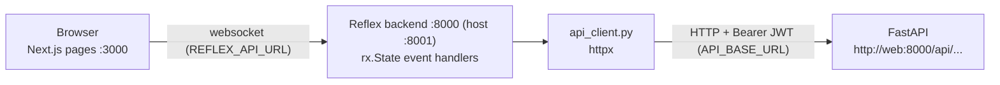
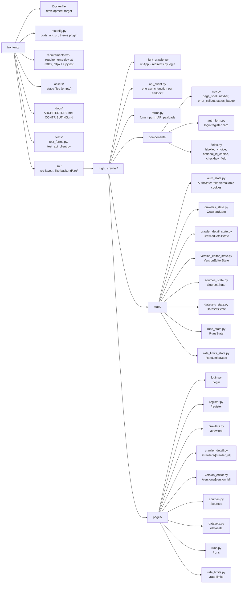

# Frontend Architecture

The frontend is a [Reflex](https://reflex.dev) 0.9 app. Reflex compiles the
Python pages into a Next.js app (port 3000) and runs a Python backend (port
8000 in the container, 8001 on the host) that holds each browser tab's state
and talks to it over a websocket.

## How It Talks to the API

- Every API call is made by an event handler, server side, through
  `api_client.py`. The browser never calls FastAPI, so FastAPI needs no CORS.
- `API_BASE_URL` (Compose: `http://web:8000`) is where the Reflex backend
  finds FastAPI. `REFLEX_API_URL` is where the *browser* finds the Reflex
  backend (dev: `http://localhost:8001`).
- A non-2xx response raises `ApiError(status_code, message)`; the message is
  the API's own `{"message"}`, or FastAPI's validation `detail` joined into
  one line. States show it in a red callout.

## Project Structure

The package is `night_crawler`, the same name as the backend's; the two
never share an interpreter (each has its own container), so they don't clash.
`PYTHONPATH` (set in the Dockerfile) points at `src/`, and Reflex loads
`night_crawler.night_crawler` because `app_name` is `night_crawler`.

Nested crawler routes show ancestor breadcrumbs on their own line, with the
current page title below at a consistent left edge. Version instructions
show **Crawlers / Version History** in the breadcrumb, **Instructions** as
the page title, and the crawler name plus version status as a subtitle.
All pages share the `page_shell` size-4 maximum content width and a responsive
20rem minimum that contracts to the viewport on narrow screens. Top-level
pages use the navbar as their primary navigation.
The version editor's templates toolbar groups **Version history**, **Test
run**, and **New template**. **Publish** remains beside the version heading.

## Pages

| Route | State | What it does |
|-------|-------|--------------|
| `/login`, `/register` | `AuthState` | Log in or create an account; both land on `/crawlers`. |
| `/crawlers` | `CrawlersState` | List crawlers; clicking a title or **Instructions** opens the editor on the draft, else the published version (`forms.editable_version_id`), else a new draft. Create a crawler or change it with **Schedule** (title, Source and Dataset picked from the stored ones, fields (the Dataset fields it downloads, comma separated), cron schedule, queue; with none yet it links to `/sources` or `/datasets`). The Source sits next to the dataset because it says where the dataset's records come from; the queue is where every run goes, and never offers `testing` (`forms.CRAWLER_QUEUES`). A schedule always runs the published version; clear it to stop; **Context** opens the Context of the crawler's latest run (test runs excluded), which its next run inherits: list its keys, add or edit one (the value is JSON, else plain text: `forms.parse_context_value`), or delete one. Values of keys that look like credentials (`key`, `token`, `secret`, `password`: `forms.is_secret_key`) are masked and never prefilled; a crawler that never ran shows the API's message instead; delete. |
| `/crawlers/[crawler_id]` | `CrawlerDetailState` | The crawler's versions: new draft, publish a draft (which archives the published one), delete a draft or archived one (the API refuses a version that has run). There is no Archive button. |
| `/datasets` | `DatasetsState` | List Datasets (the built-in `venues`, `reviews`, `menus`, plus any added) with a summary of their fields (`forms.fields_summary`: `*` required, `!` unique, `:type`, `~pattern`); create one (fields as a JSON list, `forms.build_dataset_payload`). Only admins see **Edit** and **Delete**; the API refuses deleting a Dataset a crawler uses, or an edit that would break a linked crawler's schema. |
| `/runs` | `RunsState` | Every crawler's runs, newest first, test runs included. Filters: crawler name (a debounced text box, any part of the title), queue, status, and parsing status (`forms.execution_params`). Cards for the runs shown: % succeeded, failed count, and average wait in the queue (`forms.runs_summary`). The table shows each run's execution ID (to use with `/api/crawler-executions/{id}`), a **CSV** button that downloads its dataset CSV once it has ended (`forms.has_csv`, `api_client.download_execution_csv`, `rx.download` with bytes so CRLF line endings survive), links it to its crawler, and shows how long it **Waited** before a worker started it and how long it **Ran for** (`forms.seconds_between`, `forms.format_duration`; `—` until it has). Unfiltered it pages 50 at a time (**Previous** / **Next**); filtered it shows the 50 newest matches. **Refresh** reloads; nothing polls. |
| `/rate-limits` | `RateLimitsState` | List the reusable rate-limit rules (name — by convention the domain it is for, e.g. `places.googleapis.com` —, limit such as `5/second`, and a penalty summary: `forms.rate_limit_summary`) and create one (`forms.build_rate_limit_payload`; blank numbers take the API's defaults). Only admins see **Edit** and **Delete**; deleting asks first, because templates and proxies using the rule lose it. Runs wait on these rules (docs/ARCHITECTURE.md, **Rate limits**). |
| `/sources` | `SourcesState` | List Sources and create one (name, website). Only admins see **Edit** and **Delete** (`AuthState.role`); the API refuses deleting a Source a crawler still uses. The crawler list and crawler page show each crawler's Source by name (`forms.names_by_id`). |
| `/versions/[version_id]` | `VersionEditorState` | The version's instructions. **← Crawlers** returns to the crawler list; **Version history** opens the crawler's version list. A **Publish** button next to the heading appears only on a draft: it publishes it (the API archives the published version), reloads it as published, and says "Published.". Settings on top: the version's host session sharing (the crawler's Source is set in the **Schedule** dialog, not here); the proxy ladder is not offered, since no crawl reads it yet, then the **Message templates** table (create, edit, delete, make root; an **Aid** column summarises each template's aid). Each template has a **Selectors (N)** button: clicking it (or the template's URL) opens that template's message selectors, as a tree, in a row right under it; clicking again closes it, and one template is open at a time (`selected_template_id`, `forms.toggle_selection`). Selectors and aids load with the templates, so opening one needs no request. Selector titles matching the crawler's **Fields** are bold and their rows are tinted green; all other titles feed Context. A template has at most one aid, so the aid's fields are always part of the template dialog. Saving the dialog saves the template, then, on the template the API returned (the clone after an auto-fork), puts the aid — unless it sets nothing beyond the defaults (`forms.is_default_aid`), in which case no aid is stored and an existing one is deleted. After an edit, the template it landed on stays open, including across the redirect to a forked draft. In the template dialog's aid, **Add rate limit** reads the URL's host (`forms.url_host`; a `{{placeholder}}` host has none) and selects the rule named after it (`forms.find_rate_limit_for_host`), or opens a form prefilled with that name that creates the rule and selects it. |

## Authentication

- `AuthState` keeps the JWT, email, and role in cookies
  (`night_crawler_token`, `night_crawler_email`, `night_crawler_role`, one
  week). Other states read it with `await self.get_state(AuthState)`.
- Every page behind login has an `on_load` handler that redirects to
  `/login` when there is no token; `/` sends you to `/crawlers` or
  `/login`. An expired token surfaces as the API's 401 message; log out and in.

## Versions: Draft, Publish, Archive

The rules live in the API (see the root docs); the UI only reflects them:

- A new crawler comes with draft v1 and an empty root template (shown as
  "(no URL yet)"). The API allows one draft at a time, so "New draft" is
  disabled while one exists.
- Publishing a draft archives the previously published version.
- A new draft clones the published version, else the latest archived one,
  else starts empty. A crawler with every version archived can't happen
  any more (only in older data); **Instructions** recovers from it by opening such a
  draft.
- A published version can't be archived on its own: publishing a draft is
  the only way, so once published a crawler always has a published version.
- Any edit to a **published** version makes the API fork a new draft and
  apply the edit there. After such an edit, `VersionEditorState` looks up the
  crawler's draft and redirects to it. The template the edit landed on (the
  `message_template_id`/`id` in the API's response) stays selected.
- Archived versions are read-only: every edit control is disabled.

## State Conventions

- One `rx.State` subclass per page (`AuthState` is shared by the auth
  pages and `/`); route args (`crawler_id`,
  `version_id`) are the vars Reflex creates for dynamic routes, never
  redefined.
- Dialog forms are uncontrolled (`default_value`) and re-mount through
  `key=` when their target changes. Selects are controlled by a state var
  that the submit handler reads.
- An optional id select uses `forms.NO_SELECTION` for "none", because a
  Radix select can't hold `""`; `forms.blank_to_none` turns it back into
  `null`.
- Payloads are built by pure functions in `forms.py`, which return
  `(payload, error)` and are unit-tested without Reflex.
